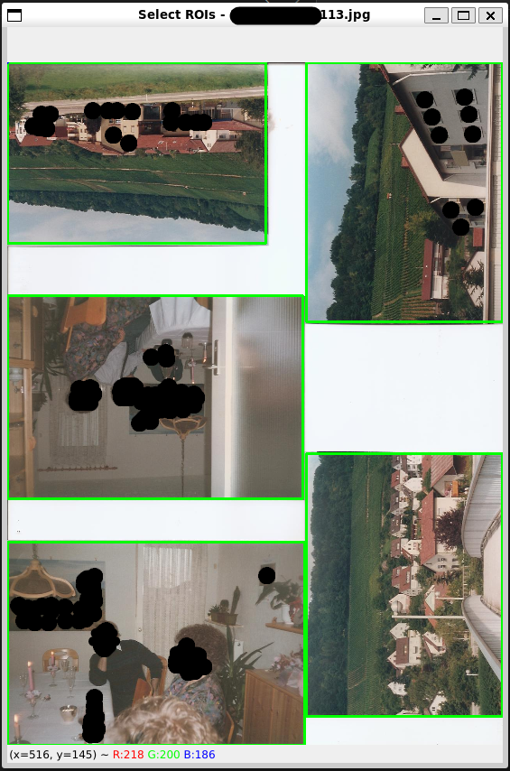

# Cropper

Cropper is a Python script that allows you to interactively select and 
crop multiple Regions of Interest (ROIs) from each JPEG file in the input
directory. The cropped ROIs are saved as separate JPEG files in the output 
directory, together with the `rois.json` with the ROI data.



## Usage

To use the Cropper script, follow these steps:

```bash
git clone github.com/olafrv/cropper.git
cd cropper
python3 -m venv .venv
source .venv/bin/activate
pip install -r requirements.txt
python3 cropper.py --input_dir composite/ --output_dir extracts/
# -----------------------------------------------
# How to use the GUI?
# * first, draw the ROIs with the mouse
# * second, press the ENTER key to save the ROIs
# * third, press ESC to go to the next image
# -----------------------------------------------
# How to exit the GUI?
# * first, CRTL+C in the terminal 
# * second, press ESC in the GUI
# -----------------------------------------------
```

## Why Cropper?

Majority of Image Croppers does not work with multiple ROIs,
overlapping pictures, lack of borders or non-homogeneous backgrounds.
AI is good for specific object detection but not for cropping pictures 
in pictures and training is not easy.

* [Adobe Photoshop](https://www.adobe.com/)
* [Auto Cropper](https://www.autocropper.io/)
* [My Self Made Auto Cropper](./trials/cropper_auto.py) 
* [Scanner Image Extractor](http://www.dominik-ruess.de/scannerExtract/)
* [AI - Detectron2](https://github.com/facebookresearch/detectron2)
* [AI - YOLOv5](https://github.com/ultralytics/yolov5)